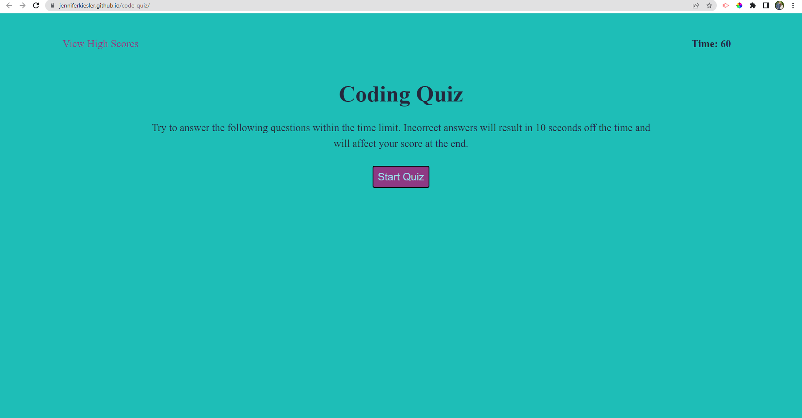

# Code Quiz

## Description

This application is a timed coding quiz with 5 multiple choice questions.

It features dynamically updated HTML and CSS powered by JavaScript like:
- When the start button is clicked, a timer starts counting down from 60 seconds and presents the first question.
- When a question is answered, another question is presented.
- When a question is answered incorrectly, 10 seconds is subtracted from the timer.
- When all the questions are answered or the timer reaches 0, the game is over and your initials and score can be saved.

## Visuals

## Deployed Link

https://jenniferkiesler.github.io/code-quiz/